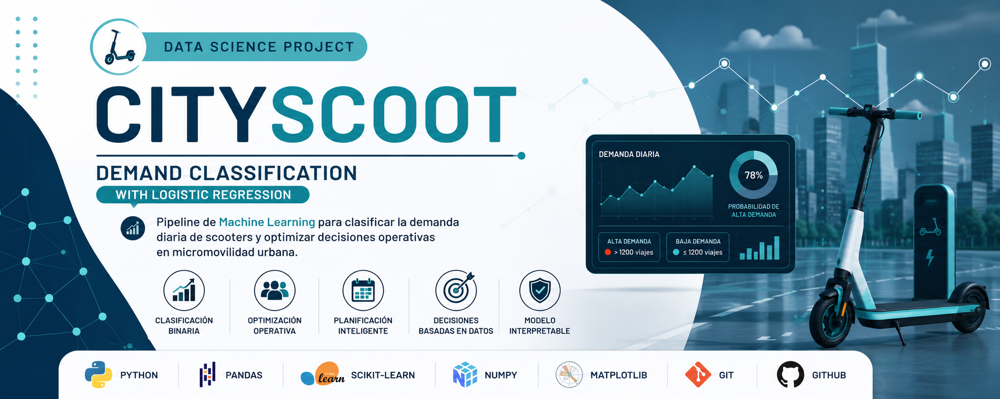
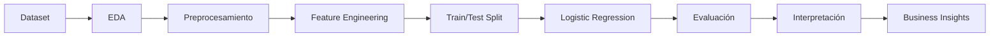

  

# 🛴 CityScoot – Demand Classification with Logistic Regression

> Pipeline de Machine Learning para clasificar la demanda diaria de scooters y demostrar cómo la correcta elección del modelo depende del objetivo de negocio.

---

📅 <strong>Dataset:</strong> Demanda diaria de scooters &nbsp;&nbsp;|&nbsp;&nbsp;
🎯 <strong>Problema:</strong> Clasificación binaria &nbsp;&nbsp;|&nbsp;&nbsp;
📈 <strong>Modelo:</strong> Logistic Regression &nbsp;&nbsp;|&nbsp;&nbsp;
🛴 <strong>Caso de uso:</strong> Micromovilidad urbana

---

# 🛠️ Tecnologías

---

# 📌 Descripción

CityScoot es una empresa de micromovilidad urbana que busca anticipar la demanda diaria de scooters para optimizar la asignación de flota, la estrategia de precios y la planificación operativa.

Inicialmente el problema fue planteado como una tarea de **regresión**, cuyo objetivo era estimar el número exacto de viajes diarios. Sin embargo, al redefinir el objetivo de negocio, el enfoque evolucionó hacia un problema de **clasificación binaria**, donde el interés pasó a ser identificar si un día presentará **alta** o **baja demanda**.

Este proyecto demuestra cómo la selección del algoritmo debe responder al problema de negocio y no únicamente a la naturaleza de los datos.

---

# 🎯 Objetivo

Clasificar cada día como:

🔴 Alta demanda (>1200 viajes)

🔵 Baja demanda (≤1200 viajes)

para anticipar decisiones operativas relacionadas con la distribución de scooters y la planificación comercial.

---

# 📂 Estructura del repositorio

| Archivo | Descripción |
|----------|-------------|
| CityScoot_LogisticRegression.ipynb | Pipeline completo de limpieza, modelado y evaluación mediante Regresión Logística |
| Dataset | Datos utilizados para el entrenamiento y evaluación |
| Images | Banner y visualizaciones |
| README.md | Documentación del proyecto |

---

# 📊 Dataset

Variables predictoras:

- Temperatura
- Precipitación
- Inversión en marketing
- Precio por minuto
- Fin de semana
- Feriado
- Eventos urbanos

Variable objetivo:

**high_demand**

---

# ⚙️ Pipeline

- Análisis exploratorio (EDA)
- Limpieza y preparación de datos
- Ingeniería de variables
- División Train/Test
- Escalado (StandardScaler)
- Entrenamiento
- Evaluación
- Interpretación del modelo

---

# 🤖 Modelo implementado

**Logistic Regression**

La Regresión Logística fue seleccionada por su capacidad para modelar probabilidades en problemas de clasificación binaria y por permitir una interpretación directa mediante Odds Ratio.

---

# 📈 Métricas evaluadas

- Accuracy
- Precision
- Recall
- ROC-AUC
- Log-Loss
- Matriz de confusión

---

# 💡 Resultados

El modelo obtuvo una adecuada capacidad discriminatoria para diferenciar días de alta y baja demanda.

Además de la predicción, permitió interpretar el efecto de variables como:

- inversión en marketing
- lluvia
- eventos urbanos
- fines de semana

sobre la probabilidad de registrar jornadas de alta demanda.

---

# 📊 Visualizaciones

## Curva ROC

*(Agregar imagen)*

La curva ROC resume la capacidad discriminatoria del modelo para diferenciar días de alta y baja demanda.

---

## Matriz de confusión

*(Agregar imagen)*

Permite evaluar el equilibrio entre falsos positivos y falsos negativos según el objetivo operativo.

---

## Importancia de variables

*(Agregar imagen)*

Los Odds Ratios permiten interpretar el efecto de cada variable sobre la probabilidad de registrar alta demanda.

---

# 💼 Impacto para el negocio

El modelo permite:

- anticipar picos de demanda
- optimizar la asignación de scooters
- planificar campañas de marketing
- ajustar estrategias de precios
- mejorar la planificación operativa

---

# 📌 Competencias demostradas

- Machine Learning
- Clasificación binaria
- Logistic Regression
- Odds Ratio
- Feature Engineering
- Model Evaluation
- Business Analytics
- Storytelling con datos

---

# 🔄 Flujo del proyecto

---

# ⭐ Aprendizajes

Más allá del desempeño predictivo, el principal aporte del proyecto fue demostrar que la selección del modelo debe responder al objetivo de negocio.

El trabajo evidencia competencias en pensamiento estadístico, modelado probabilístico e interpretación de resultados para apoyar la toma de decisiones.

---

# 👩‍💻 Autora

**Vanina Cavallin**

Doctora en Ciencias Biológicas

Data Scientist | Data Analyst

📧 **Email:** vaninacavallin@gmail.com

💼 **LinkedIn:** https://linkedin.com/in/vanina-cavallin

---

⭐ Si este proyecto te resultó interesante, no olvides dejar una estrella al repositorio.
